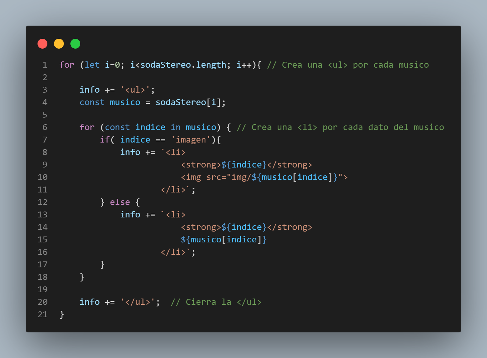

# Ejercicio 1

Tomando como base la matriz sodaStereo:
* Modificar las posiciones numéricas del segundo nivel por posiciones asociativas.
* Con un for común recorrer el primer nivel.
* Dentro del for, utilicemos un for in para ir recorriendo cada índice del segundo nivel  (utilizar un condicional para ver si es el campo correspondiente a la imagen para  mostrarlo dentro de una etiqueta img).
* Utilizar el índice asociativo como título del campo a mostrar.
Iremos armando todo en una variable info que luego será mostrada en el HTML.  Cada integrante en un ul, cada campo en un li, el “título” en etiquetas strong.  
